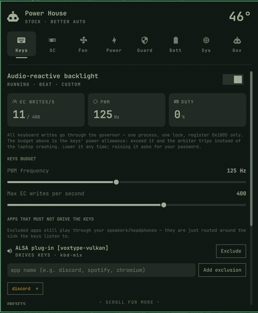
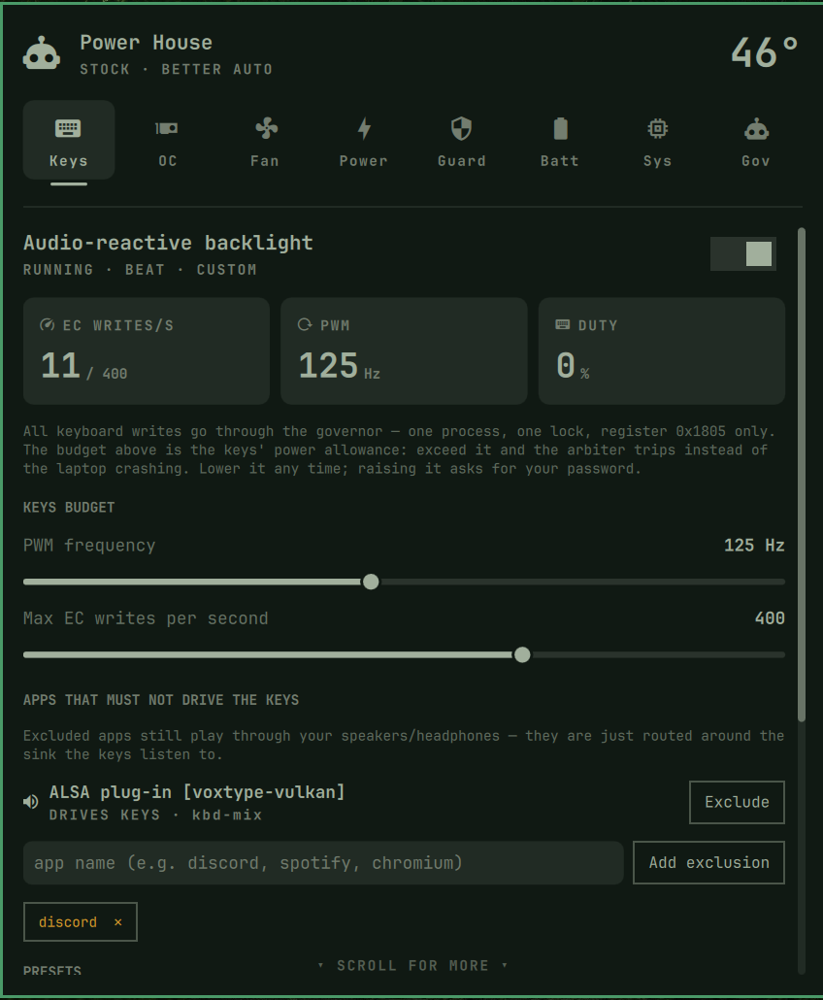
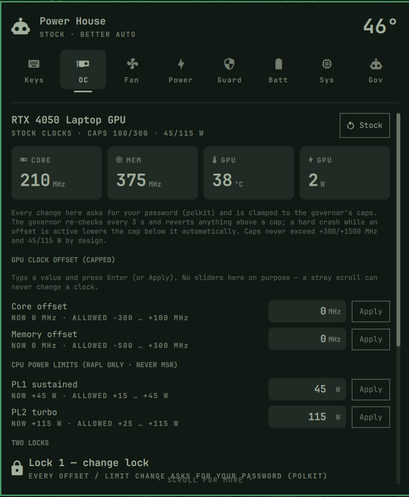
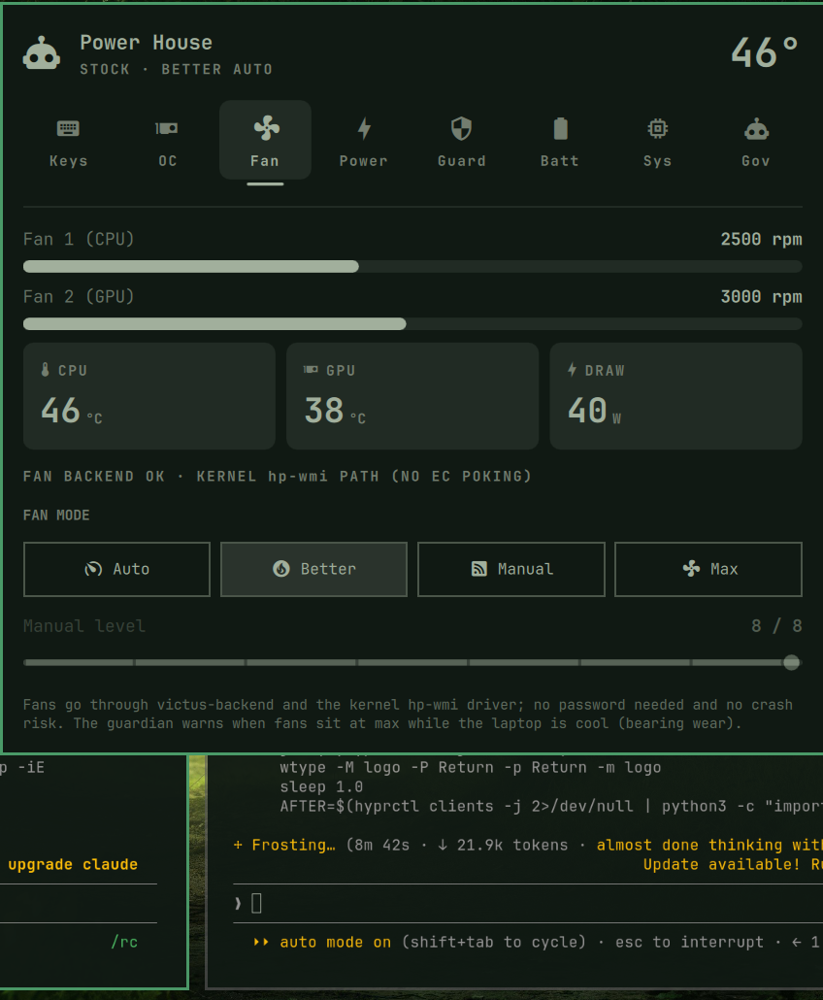
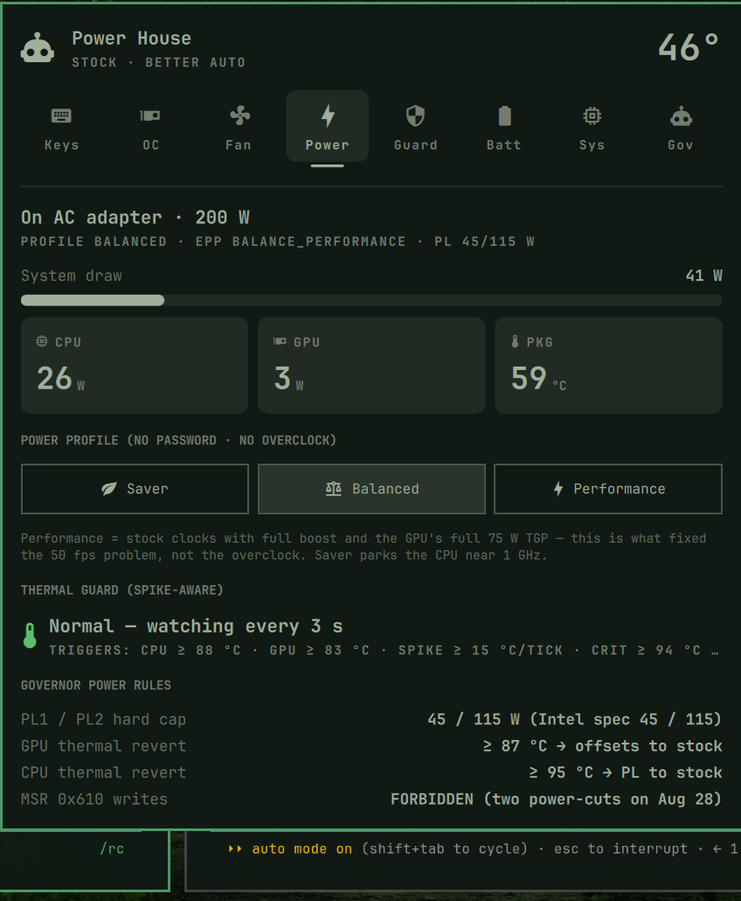
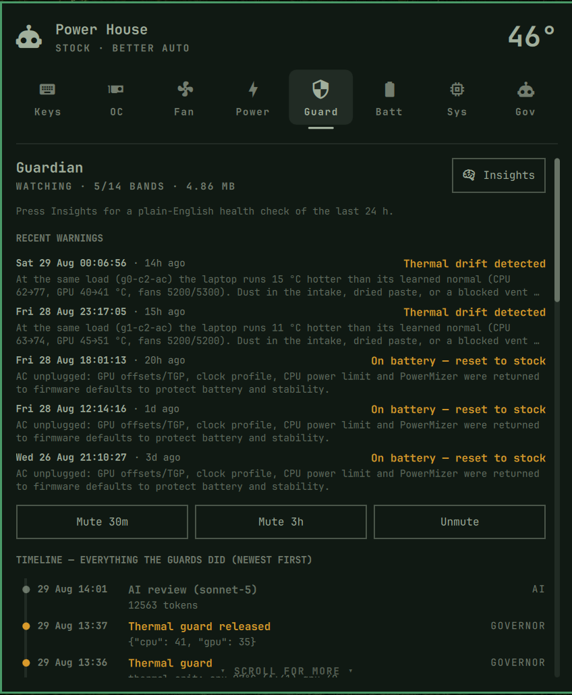
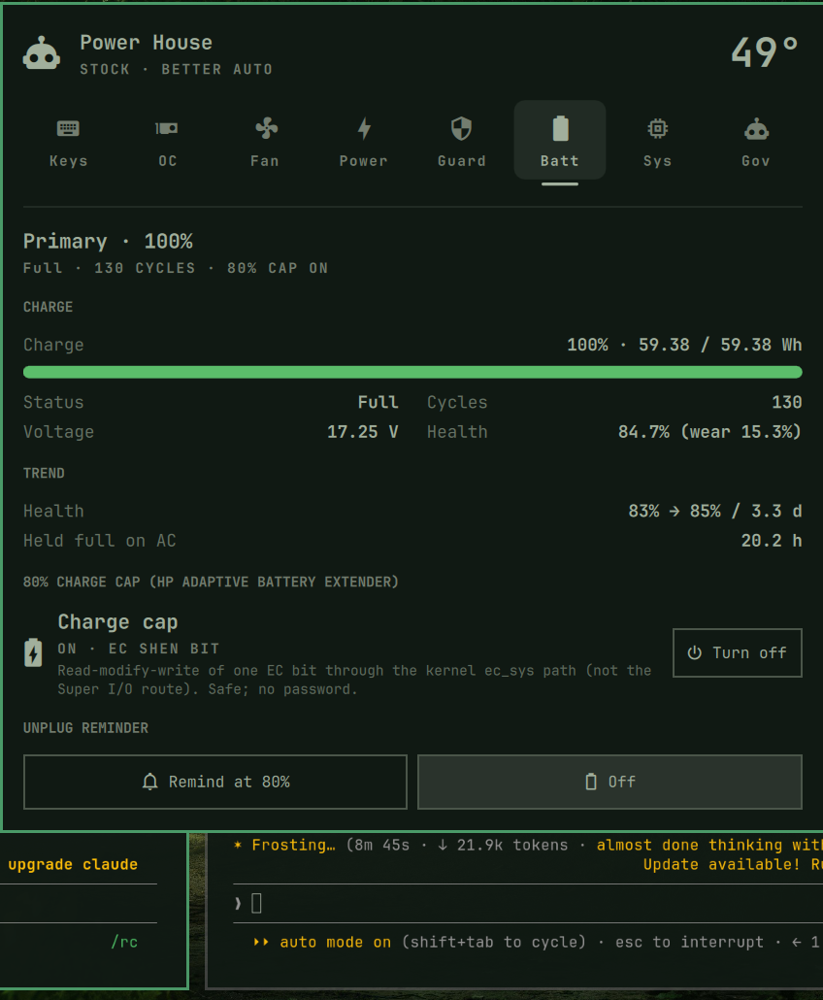
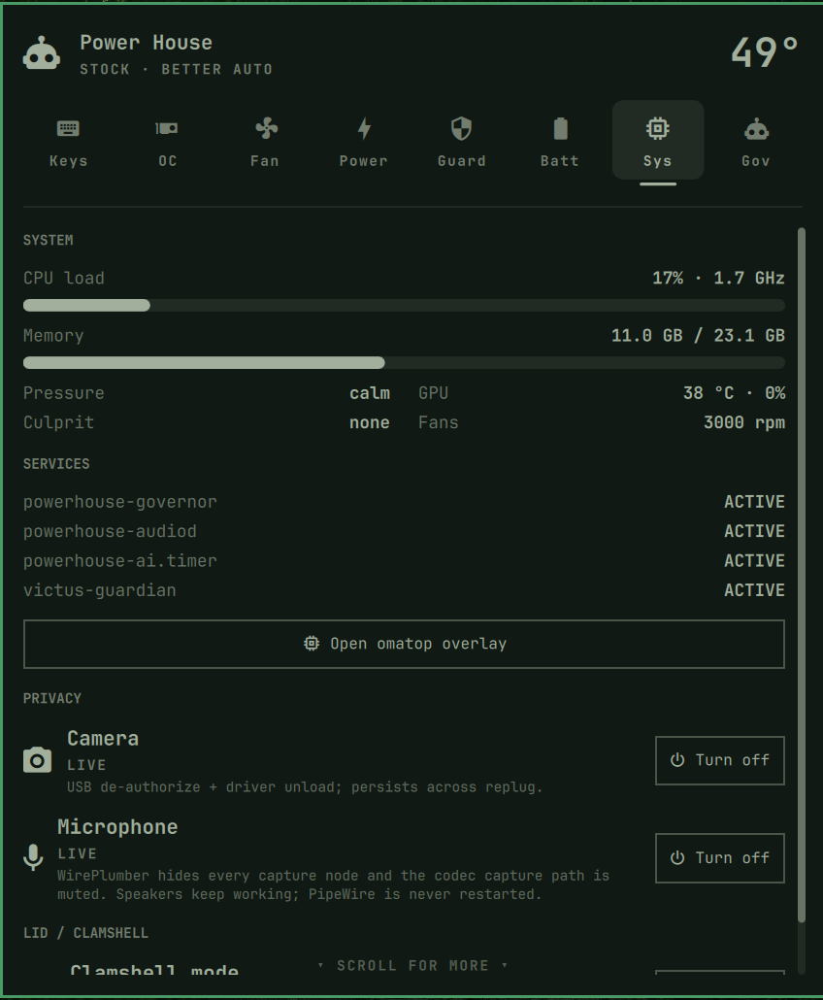
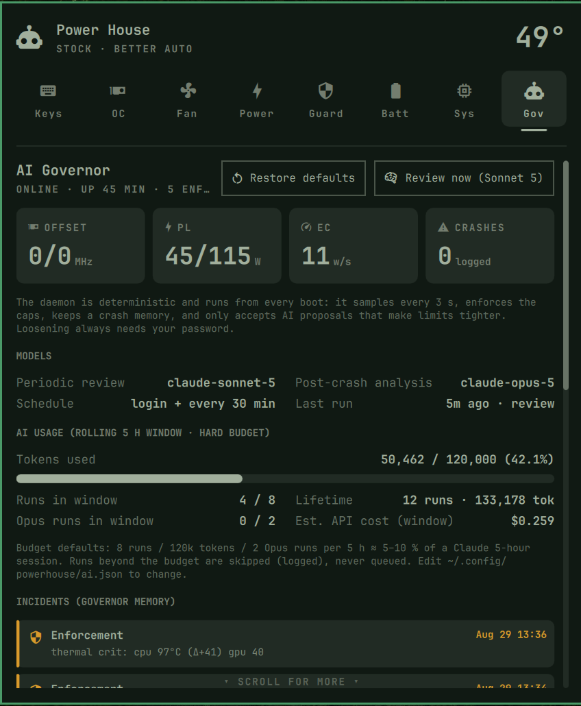

# Power House — governed laptop control for Omarchy (HP Victus 15)

**One bar plugin. One root governor that owns every dangerous knob. One AI
reviewer that watches for trouble.** Built after a run of real hard crashes
on this exact laptop — see [Why it exists](#why-it-exists) for the story.


*(drop a short screen recording at `assets/demo.gif` — see [Adding your own screenshots](#adding-your-own-screenshots))*

> **⚠️ Read this before installing.** This is a root-privileged system, not a
> sandboxed widget:
> - Verified only on **HP Victus 15-fa1xxx, board `8BB1`**. It pokes EC
>   registers directly through Super I/O ports 0x2E/0x2F, writes CPU MSR
>   0x610, and issues GPU clock/power-limit calls. On different hardware the
>   EC register map and MSR behavior may not match — review the source
>   (especially `governor/powerhouse-governor`) before running this on
>   anything else.
> - The governor daemon runs as **root** at boot. Every actual tweak still
>   needs **your password every time** (polkit `auth_admin`) — see
>   [How the root access actually works](#how-the-root-access-actually-works)
>   below for exactly what runs as root and when.
> - `powerhouse-ai` calls **your own** Claude Code login on a timer — see
>   [Setting up the AI governor](#setting-up-the-ai-governor-logging-in-with-your-ai-model).
> - No warranty. Offered as-is, not as a certified-safe product.

## Table of contents

1. [What you get](#what-you-get)
2. [Screenshots](#screenshots)
3. [Prerequisites](#prerequisites)
4. [Step 1 — Install](#step-1--install)
5. [How the root access actually works](#how-the-root-access-actually-works)
6. [Step 2 — Set up the AI governor (logging in with your AI model)](#step-2--set-up-the-ai-governor-logging-in-with-your-ai-model)
7. [Using Power House, tab by tab](#using-power-house-tab-by-tab)
8. [Uninstall](#uninstall)
9. [Why it exists](#why-it-exists)
10. [Architecture, for the curious](#architecture-for-the-curious)
11. [Files](#files)
12. [Adding your own screenshots](#adding-your-own-screenshots)

## What you get

* A bar widget with **8 tabs** — Keys, OC, Fan, Power, Guard, Batt, Sys, Gov —
  each a small dashboard for one part of the laptop.
* A **root governor** service that is the *only* process allowed to touch the
  EC (embedded controller), and clamps every overclock/power tweak to hard
  safety limits no matter who asks.
* An **AI governor**: on a timer, your own Claude Code login reviews the
  hardware logs and can *tighten* (never loosen) the safety limits after
  something looks wrong.
* A full audit trail: every incident, every AI run, every tweak — all on one
  timeline in the Guard tab.

## Screenshots

Real screenshots go here once added — see
[Adding your own screenshots](#adding-your-own-screenshots) for exact
filenames.

| Tab | What it shows |
|---|---|
|  | **Keys** — keyboard backlight status (Fn+F4 hardware toggle) and audio-reactive settings. |
|  | **OC** — GPU clock/memory offsets, current vs. capped values, and the crash-lock state. |
|  | **Fan** — RPM for both fans, mode (Auto/Better Auto/Max). No password needed here — fans can't crash the machine. |
|  | **Power** — CPU PL1/PL2 watts, profile, package temperature. |
|  | **Guard** — merged timeline of thermal-guard events, governor incidents, and AI runs. |
|  | **Batt** — battery charge, the HP 80% charge-cap toggle. |
|  | **Sys** — service health (governor, audiod, AI timer). |
|  | **Gov** — governor limits, lock state, and the AI token/budget meter. |

## Prerequisites

Power House **orchestrates** three other pieces of software — it doesn't
replace them. Install them first, in this order:

**Step 1.** [`victus-control`](https://github.com/Batuhan4/victus-control)
(upstream project, not mine) — the fan backend. Power House's fan tab talks
to its `victus_backend.sock`.

**Step 2.** [`hp-wmi-victus-8bb1`](https://github.com/unique-spider/hp-wmi-victus-8bb1)
— a patched `hp-wmi` kernel module (DKMS) adding board `8BB1` support, needed
for GPU CTGP/PPAB and CPU power-limit control via WMI. Skip this one if you
don't need those two features.

**Step 3.** [`victus-toolkit`](https://github.com/unique-spider/victus-toolkit)
— `victus-priv` and friends: the small, argument-validated privileged helper
that the governor and sudoers rule (`governor/sudoers.victus-plugin`) call
into for EC/GPU/keyboard operations.

## Step 1 — Install

**Option A — via the Omarchy plugin marketplace** (clones straight into
`~/.config/omarchy/plugins/uniquespider.powerhouse/`):

```sh
# 1. Add the plugin (downloads the repo, does not touch your system yet)
omarchy plugin add https://github.com/unique-spider/powerhouse.git --yes

# 2. Run the installer — this is the one point that asks for your password
sudo ~/.config/omarchy/plugins/uniquespider.powerhouse/install.sh

# 3. Turn the bar widget on
omarchy plugin enable uniquespider.powerhouse --section center
```

**Option B — manual clone**, if you'd rather keep a dev checkout somewhere
of your choosing:

```sh
# 1. Clone it anywhere
git clone https://github.com/unique-spider/powerhouse.git && cd powerhouse

# 2. Install (asks for your password once)
sudo ./install.sh

# 3. Turn the bar widget on
omarchy-plugin-enable uniquespider.powerhouse center

# 4. Optional: turn off the older, unrelated Victus widget if you have it
omarchy-plugin-disable anbuselvan.victus
```

Either way, `install.sh` must be run with `sudo` as **your normal user**
(not logged in directly as `root`) — it reads `$SUDO_USER` to know who you
are, and refuses to run if that's unset.

## How the root access actually works

This is the part worth understanding before you type your password. Here's
exactly what happens, step by step:

1. **You run `sudo ./install.sh` once.** That single password entry lets the
   *installer* — not the plugin itself — copy a handful of files into place:
   a root-owned governor binary, a systemd service, a polkit policy file, and
   a narrow sudoers rule. This step never runs again unless you reinstall.
2. **The governor daemon starts at boot, as root, forever.** But its own
   power is deliberately tiny: it only touches a *single whitelisted EC
   register* (`0x1805`, the keyboard backlight), it has a write-rate budget
   with a trip switch, and it only *enforces* the caps already written in
   `/etc/powerhouse/limits.json` — it never invents a new, looser limit on
   its own.
3. **Any time you actually want to change something** — an overclock offset,
   a power limit — that request goes through `powerhouse-apply`, launched
   via `pkexec`. This pops the normal Linux polkit **password dialog every
   single time**, with no caching. There's no way to "log in once" and get
   silent root access afterward — that's intentional friction, not a bug.
4. **A few read-only / stock-restoring commands are pre-approved** (see
   `governor/sudoers.victus-plugin`) so the panel can show live EC/GPU/
   battery readings without a password popup on every refresh. Every one of
   those commands is a fixed, argument-validated operation (regex-checked,
   hard-clamped ranges) — never free-form input reaching a shell.
5. **Anything that would loosen a safety cap is extra-gated**: offsets that
   were live during a real hard crash get locked into
   `limits.json.crash_locked`, and only a separate, explicitly-named polkit
   action (`powerhouse-unlock`) — with its own crash warning — can release
   that lock.

If you only remember one thing: **installing grants nothing standing** — the
daemon that runs forever is scope-limited by design, and every real hardware
change still stops and asks you for your password.

## Step 2 — Set up the AI governor (logging in with your AI model)

The AI governor is **your own** [Claude Code](https://claude.com/claude-code)
login, invoked headlessly on a timer — Power House does not ship any API key
or account of its own. Set it up like this:

**Step 1. Install the Claude Code CLI**, if you don't already have it —
via [mise](https://mise.jdx.dev/) (what this machine uses):

```sh
mise use -g claude
```

or via npm:

```sh
npm install -g @anthropic-ai/claude-code
```

**Step 2. Log in once, interactively:**

```sh
claude
```

This opens the normal Claude Code login flow in your browser (or lets you
paste an API key if you're using the Anthropic API instead of a Claude
subscription). You only need to do this once — the credentials it saves are
what `powerhouse-ai` reuses headlessly later. Exit with `/exit` or `Ctrl+D`
once you see the prompt.

**Step 3. Confirm headless mode works** — this is the exact call
`powerhouse-ai` makes:

```sh
claude -p "reply with OK"
```

If that prints `OK` (or similar), you're set.

**Step 4. Review the budget**, in `~/.config/powerhouse/ai.json` (created by
`install.sh` with sane defaults):

```json
{
  "model_review": "claude-sonnet-5",
  "model_crash": "claude-opus-5",
  "budget_window_h": 5,
  "budget_runs": 8,
  "budget_tokens": 120000,
  "budget_opus_runs": 2,
  "max_usd_per_run": 0.6
}
```

Runs beyond this budget are skipped (and logged), never queued up for later.

**Step 5. Confirm the timer is running:**

```sh
systemctl --user status powerhouse-ai.timer
```

`install.sh` already enables and starts it (login + every 30 minutes). To
turn it off entirely:

```sh
systemctl --user disable --now powerhouse-ai.timer
```

## Using Power House, tab by tab

Open the panel by clicking its bar icon, or from a terminal:

```sh
quickshell ipc -p /usr/share/omarchy/shell --any-display call uniquespider.powerhouse tab keys
# tab names: keys, oc, fans, power, guard, battery, system, gov
```

* **Keys** — keyboard backlight status. Steady on/off is Fn+F4 hardware only
  (no software control exists on this EC); audio-reactive mode is here too.
* **OC** — GPU core/memory offset, current value vs. your cap, and whether
  a crash lock is active. Changing anything here asks for your password.
* **Fan** — RPM for both fans and the current mode. No password, no crash
  risk — fans can't damage anything, they just spin.
* **Power** — CPU PL1/PL2 watts, the active profile, and package temp.
* **Guard** — one merged timeline: thermal-guard trips, governor incidents,
  and every AI run, worst-first.
* **Batt** — charge percentage and the HP Adaptive Battery Extender
  (~80% cap) toggle.
* **Sys** — at-a-glance health for the governor, audio router, and AI timer
  services.
* **Gov** — the enforced limits, lock state, and the AI token/cost meter
  against your budget.

## Uninstall

There's no `uninstall.sh` yet — remove it by hand:

```sh
# Bar plugin
omarchy plugin disable uniquespider.powerhouse
rm -rf ~/.config/omarchy/plugins/uniquespider.powerhouse

# User-level services
systemctl --user disable --now powerhouse-audiod.service powerhouse-ai.timer
rm -f ~/.config/systemd/user/powerhouse-{audiod,ai}.service ~/.config/systemd/user/powerhouse-ai.timer
rm -f ~/.local/bin/powerhouse ~/.local/bin/powerhouse-audiod ~/.local/bin/powerhouse-ai
rm -rf ~/.config/powerhouse ~/.local/state/powerhouse   # drops AI usage history and your audio exclusions

# Root-level (governor, polkit, sudoers)
sudo systemctl disable --now powerhouse-governor.service
sudo rm -f /etc/systemd/system/powerhouse-governor.service
sudo rm -f /usr/local/bin/powerhouse-governor /usr/local/bin/powerhouse-apply /usr/local/bin/powerhouse-unlock
sudo rm -f /usr/share/polkit-1/actions/com.uniquespider.powerhouse.policy
sudo rm -f /etc/sudoers.d/victus-plugin
sudo rm -rf /etc/powerhouse /var/lib/powerhouse /usr/local/share/powerhouse
sudo systemctl daemon-reload
```

`kbdlight-helper` is replaced in place (not removed) — it's shared with the
`victus-toolkit` keyboard-brightness path. If `install.sh` found a **setuid**
kbdlight-helper before overwriting it, it saved that original binary as
`/usr/local/bin/kbdlight-helper.setuid.bak`. Do not restore it: a setuid
helper poking EC RAM from a second process was the original cause of the
hard crashes this project exists to fix (see below) — it's kept only as a
reference, not something to reinstate.

## Why it exists

* 4–5 hard crashes/day since 2026-08-26 16:34 — the moment a setuid helper
  started driving the keyboard backlight by poking EC RAM through Super I/O
  ports 0x2E/0x2F from **two separate processes** (a PWM daemon and the
  hotkey on/off helper). The 4-step address/data sequence is not atomic;
  interleaved writers land bytes on random EC registers. The helper's own
  source already mentioned "phantom keys" from continuous PWM — the same
  corruption.
* 3 of the 4 crashes on Aug 28 happened with the GPU idle at stock clocks
  and the CPU at ~50 °C. The +200/+600 MHz GPU offset was only active during
  the last one.
* Two earlier power-cuts landed seconds after direct MSR 0x610 writes.

## Architecture, for the curious

| Piece | Runs as | Job |
|---|---|---|
| `powerhouse-governor` | root, `powerhouse-governor.service` (every boot) | **EC arbiter** (single lock, register whitelist `0x1805`, write-rate budget with trip), keyboard soft-PWM, 3 s enforcement of `/etc/powerhouse/limits.json`, crash memory (`/var/lib/powerhouse/{last-state.json,incidents.jsonl,events.jsonl}`), applies `desired.json` clamped to caps |
| `powerhouse-apply` | root via **pkexec** (polkit `auth_admin` → password every time) | the only writer of `desired.json`; the only path that can **loosen** caps (hard bounds: core ≤ +300, mem ≤ +1500, PL ≤ 45/115 W) |
| `kbdlight-helper` (shim) | user, not setuid | same CLI as the old helper, but only forwards duty values to the governor socket |
| `powerhouse-audiod` | user service | per-app routing: excluded apps bypass the `kbd-mix` sink the keys listen to |
| `powerhouse-ai` | user timer (login + 30 min) | Claude Code `-p`: Sonnet 5 reviews, Opus 5 after a crash; may only **tighten**; rolling 5 h budget (8 runs / 120k tokens / 2 Opus) |
| `powerhouse` | user CLI | status JSON for the panel; actions |
| `plugin/` | Omarchy shell | tabs Keys · OC · Fan · Power · Guard · Batt · Sys · Gov |

Thermal guard (spike-aware): CPU ≥ 88 °C, GPU ≥ 83 °C or a rise ≥ 12 °C
within one 3-s tick ⇒ fans max, CPU PL 35/55 W, GPU offsets cleared;
CPU ≥ 94 °C ⇒ PL 20/35 W + low-power profile. Released after 60 s below
75 °C. Each event is an incident and flags a Sonnet review.

Two locks on overclocking: (1) every change asks for the password (polkit
`com.uniquespider.powerhouse.tweak`); (2) offsets that were live at a hard
crash are recorded in `limits.json` → `crash_locked` and `loosen` refuses to
reach them; `powerhouse-unlock` (its own polkit action with a crash warning)
is the only way to release a lock. Seeded with +200/+600 from the
2026-08-28 23:19 crash. The Guard tab shows a merged timeline (guardian
alerts, governor incidents/events, AI runs).

Crash-aware tightening: on boot, if the clean-shutdown marker is missing,
the last state is recorded as an incident, offset caps drop 50 MHz below
whatever was active, PL caps return to stock, keyboard PWM budget halves,
and an Opus 5 review is requested.

## Files

* `/etc/powerhouse/limits.json` — enforced caps (`source` says who set them)
* `/etc/powerhouse/desired.json` — what you asked for (via pkexec)
* `/var/lib/powerhouse/` — governor memory
* `~/.config/powerhouse/{audio,ai}.json` — exclusions, AI models & budget
* `~/.local/state/powerhouse/{lessons.md,usage.jsonl,ai-runs.jsonl,last-*.md}` — AI memory and consumption

**Testing done** (dry-run, `POWERHOUSE_PREFIX=…`): enforcement (offset
200/600 & PL2 150 → stock within one tick), shim pwm/on/off, SIGKILL → next
start logs `boot.crash_detected`, tightens caps and sets the AI flag,
over-cap `desired.json` clamped, AI proposal accepted only when tighter
(with floors), SIGTERM → marker → `boot.clean`; audio router moves a fake
app both ways; one real Sonnet 5 review with usage accounting.

## Adding your own screenshots

Drop image files into `assets/` with these exact names and they'll show up
in this README automatically (GitHub renders them from the repo):

| File | Used for |
|---|---|
| `assets/demo.gif` | Top-of-README animated demo — a short recording cycling through a few tabs |
| `assets/tab-keys.png` | Keys tab |
| `assets/tab-oc.png` | OC tab |
| `assets/tab-fan.png` | Fan tab |
| `assets/tab-power.png` | Power tab |
| `assets/tab-guard.png` | Guard tab |
| `assets/tab-batt.png` | Batt tab |
| `assets/tab-sys.png` | Sys tab |
| `assets/tab-gov.png` | Gov tab |

A PNG per tab plus one short GIF cycling through 3–4 of them is plenty —
no need for a recording of every single tab.
